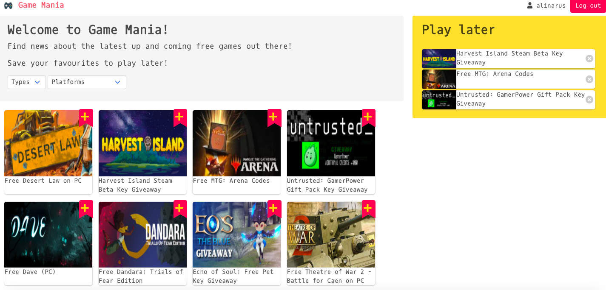
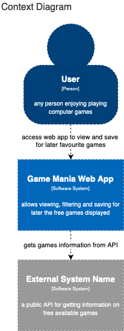
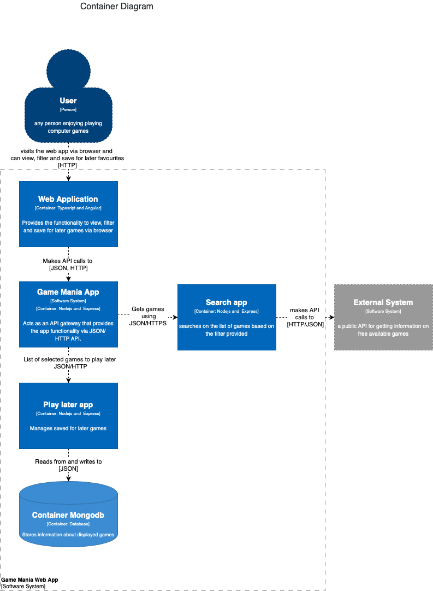
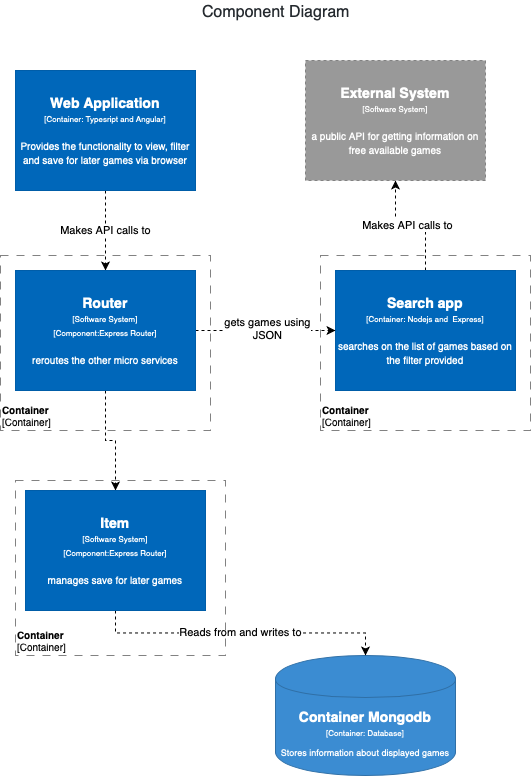

# Game Mania 

Web application that displays information about free games that you can save for later. 



# Installation

```sh
$ docker-compose up
```

# Architecture

Context Diagram



Container Diagram



Component Diagram




SOA patterns

* API Gateway – Game Mania App acts as an api gateway of the system, redirecting client calls to the microservices that are responsible for them.
* Database per service - Each microservice that requires a database has one, even if in this case only the play later App does.
* Service instance per container - Each service instance is deployed in a separate docker container.


